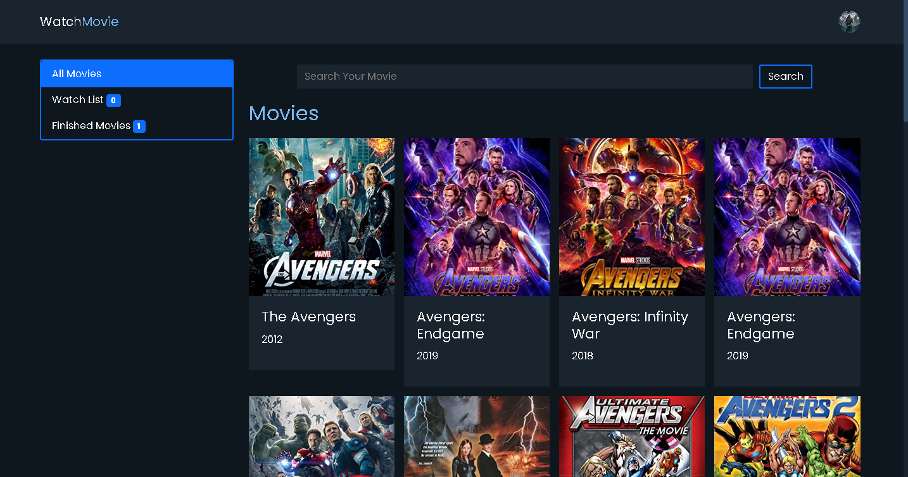
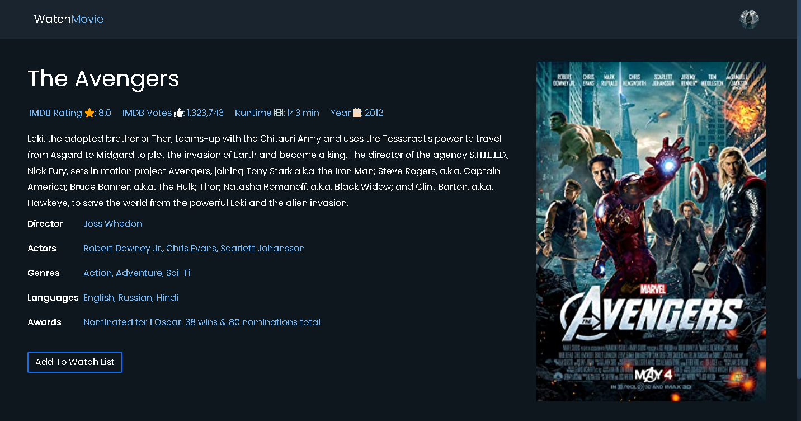

# Redux Movie App

Link to [Live Site](https://redux-movies-17580.web.app/)

Link to [API USED IN THIS PROJECT](http://www.omdbapi.com/)




Complete responsive website with google authentication. User can search any movie and add it to the watch list or add it to the finished list or remove it from the finished list. All the data are persisted in the localstorage of browser.

## Tech Stack

- ReactJS
- React Routing
- Redux Toolkit
- SCSS
- Firebase Authentication

## How to clone this repository

```
    git clone https://github.com/Suplob/redux-movie.git
    cd redux-movie
    npm i
```
